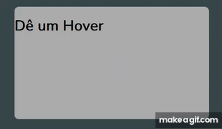

# Clip-Path
### Atenção nesse diretorio terá apenas a propriedade circle() e inset()
caso queira ver mais que isso aqui está o link da fonte
[MDN Clip-Path](https://developer.mozilla.org/en-US/docs/Web/CSS/clip-path)

## Circle

recebe os valores em qualquer unidade de medida.

quanto maior o valor, mais ele expoe o elemento.

## como é escrito?

### clip-path: circle(40%);

## Propriedade at
o circle aceita mais uma propriedade o "at" que diz a posição que ele vai estar

### clip-path: circle(40% at 85% 21%); (exposição% esquerda% cima%)

50% = ao meio 

100% = ao lado oposto que ele está

## veja os exemplos abaixo para ter uma ideia

  <h3>Circle 10% a 100%</h3>
  

 

## Inset

recebe os valores em qualquer unidade de medida.

quanto maior o valor, MENOS ele expoe o elemento o oposto do circle.

## como é escrito?

### clip-path: inset(50% 50% 100% 50%); (cima% direita% baixo% esquerda%)
 
## Exemplo logo abaixo

  <h3>inset pirueta</h3>
  

